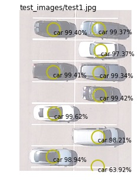

#  AI Demos zur #DPK18

In diesem Repository sind die Codeschnipsel und Beispiele aus der Session "Künstliche Intelligenz & Machine Learning: Eindrucksvolle Demos, mit denen Sie neue Projekte generieren" von der #DPK18 gesammelt.

# Cognitive Services Demos

[Azure Cognitive Services](https://azure.microsoft.com/en-us/services/cognitive-services/) sind vortrainierte Machine Learning Modelle, die einfach per REST-API nutzbar sind. Diese Funktionalitäten ermöglichen es Entwickler, Applikation ohne tieferes Machine Learning Wissen intelligenter zu machen. Die Cogntive Services sind in fünf Kategorien aufgeteilt:

* Bilderkennung und -verständnis ([Vision](https://azure.microsoft.com/en-us/services/cognitive-services/directory/vision/))
* Spracherkennung ([Speech](https://azure.microsoft.com/en-us/services/cognitive-services/directory/speech/))
* Sprach- und Textverständnis ([Language](https://azure.microsoft.com/en-us/services/cognitive-services/directory/lang/))
* Wissen ([Knowledge](https://azure.microsoft.com/en-us/services/cognitive-services/directory/know/))
* Suche ([Search](https://azure.microsoft.com/en-us/services/cognitive-services/directory/search/))

## Demo Notebooks

Unter [diesem Link](https://azure.microsoft.com/de-de/try/cognitive-services/my-apis/) lassen sich kostenlose Zugangcodes für Cognitive Services generieren. Die folgenden Jupyter Notebooks (`*.ipynb`) lassen sich kostenlos auf [Azure Notebooks](https://notebooks.azure.com) ausführen:

* [vision.ipynb](notesbooks/vision.ipynb) - Beispiele zu Cognitive Services Vision und Face API
* [speech.ipynb](notesbooks/speech.ipynb) - Beispiele zu Cognitive Services Speech API
* [search.ipynb](notesbooks/search.ipynb) - Beispiele zu Cognitive Services Search API (Bing)

Weitere Codebeispiele finden sich [hier](https://docs.microsoft.com/en-us/azure/cognitive-services/).

# Azure Bot Service - Chatbots und Virtuelle Assistenten auf Azure bauen

Mit dem [Azure Bot Service](https://azure.microsoft.com/en-us/services/bot-service/) lassen sich einfach Chatbots und Virtuelle Assistenten auf Azure entwickeln. Eine komplette Demoapplikation findet sich [hier](https://demos.microsoft.com/demos/details/185).

# Azure Custom Vision - Autos und Parkplätze in Luftaufnahmen erkennen 

Mit dem [Azure Custom Vision](https://www.customvision.ai) Service lassen sich domänenspezifische Objekte in Bildern erkennen. So können z.B. anhand von Bildaten (Überwachungskamera, Dronenvideos, etc.) folgende Szenarien einfach umgesetzt werden:

* Erkennen von Maschinen oder Arbeitswerkzeug auf einer Baustelle
* Kennen von Gegenständen in der Produktion
* Erkennen von z.B. Produkten in Social Media Posts oder anderen Bilder- und Videoquellen

In [dieser vorgefertigten Demo](https://github.com/csiebler/parking-lot-demo-custom-vision) erkennt [Azure Custom Vision](https://www.customvision.ai) anhand von Luftaufnahmen Autos in Bildern:

Eingabebild:

In der Ausgabe werden Autos erkannt:

So könnte z.B. bestimmt werden, ob noch freie Parkplätze verfügbar sind, oder wie die Parkplatznutzung über die Zeit hinweg ist.

# Azure Search und Azure Cognitive Search

Mit [Azure Search](https://azure.microsoft.com/en-us/services/search/) und dem eingebauten Feature [Cognitive Search](https://docs.microsoft.com/en-us/azure/search/cognitive-search-concept-intro) können Sie strukturierte Daten aus z.B. SQL Datenbank, aber auch beliebigen Text, Bilder, Audio- und Videomaterial extrem schnell durchsuchbar machen.

Eine direkt nutzbare Demo sind die [JFK Files](https://jfk-demo.azurewebsites.net):

Die US Regierung veröffentliche letztes Jahr 34.000 Seiten zum Modelfalls JFKs. Viele der Dokumente sind unstrukturierte, handgeschrieben Dokumente im PDF Format. Mit traditionellen Methoden würde es Monate bis Jahre dauern, diese Daten korrekt zu analysieren und zu verknüpfen. [Azure Search](https://azure.microsoft.com/en-us/services/search/) für beim Laden der Daten direkt Handschrifterkennung, Texterkennung (OCR = Optical Character Recognition), Bilderkennnung (Persönlichkeiten), Orte und Firmennamen durch, um so den Datenbestand schnell durchsuchbar zu machen.

## Demonutzung

* [Demo Website](https://jfk-demo.azurewebsites.net) aufrufen und "Oswald" in die Suche eingeben - Man sieht daraufhin alle Dokumente, die mit der Person "Oswald" assoziiert wurden. Dies umfasst Textdokumente, aber ebenso auch Bilder. Wichtig hierbei ist, dass auch der "Codename" für Oswald ("GPFLOOR") direkt gefunden wurde, da Azure Search auch direkt Synonyme in der Suchanfrage berücksichtigt. Durch klicken auf das Graphsymbol oben rechts, lassen sich ebenso die gefunden Informationen in Relation setzen.
* Ebenso kann z.B. "SQL" in die Suche eingeben - Hier sieht man, dass das FBI ursprünglich SQL Server benutzte, um diesen Datenbestand durchsuchbar zu machen. Heutzutage ist dies mit Technologie wie z.B. Azure Search wesentlich einfacher möglich

## Weitere Anwendungsszenarien

* Archive durchsuchbar machen
* Verträge durchsuchbar machen
* Juristik, Kriminaltechnik, Gesundheitswesen - Liegen Daten zu Person X oder Fall X vor? 
* Geolocation von Daten durchsuchbar machen "zeige alle relevanten Datenpunkte im Umkreis von 10km"
* Suchplatform für z.B. Produkte in Webshops, Jobanzeigen, etc.

# Weiterführendes

Einen guten Einstieg anhand von Beispielen in das Thema "Machine Learning" bietet die [Azure AI Gallery](https://gallery.azure.ai). Dort finden sich tausende Beispiele zum Thema Machine Learning und ebenso schon vortrainerte Modelle, welche einfach deployed und angewendet werden können.